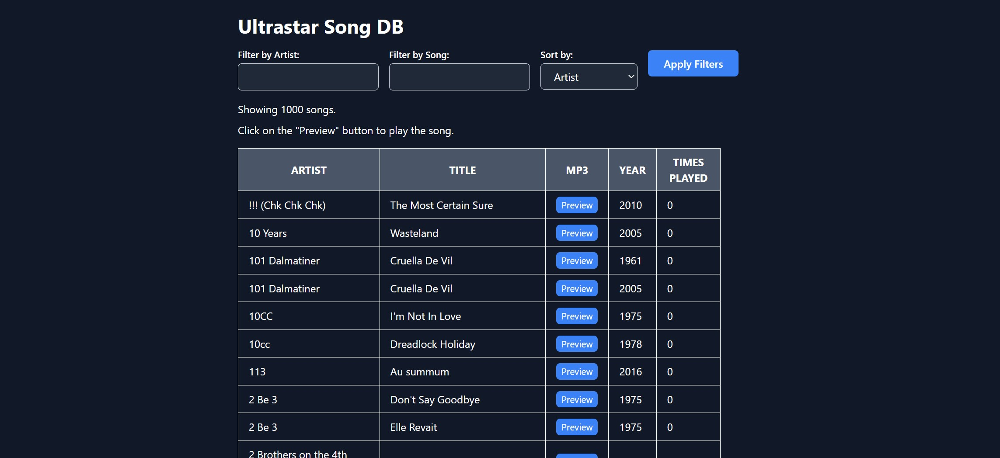

# UltraStar Web Server
UltraStar Web Server is a web application that provides an interface for browsing, searching, and playing songs from the popular karaoke game UltraStar Deluxe. It is written in Python using the Flask framework and SQLAlchemy for database management.



## Features

- Browse, search, and play songs from your UltraStar Deluxe library
- View song metadata such as artist, title, language, and year
- Sort songs by artist, title, year or times played
- Access your UltraStar Deluxe library from any device on your local network

## Installation

1. Install [Poetry](https://python-poetry.org/docs/#installation) if you haven't already.
2. Clone this repository: git clone https://github.com/your_username/ultrastar-web-server.git`
3. Navigate to the project directory: cd ultrastar-web-server`
4. Run `poetry install` to install all dependencies.

## Configuration

1. Create a `.env` file in the project directory and add the following variables:

   ```
   QR_URL=http://your_local_ip_address:5000
   SONGFOLDER=path_to_your_songs_directory
   SONG_DB=sqlite:///path_to_your_songs.db_file
   ULTRASTAR_DB=sqlite:///path_to_your_ultrastar_database_file
   ```

   Replace `your_local_ip_address` with your computer's local IP address, `path_to_your_songs_directory` with the path to your UltraStar Deluxe songs folder, and `path_to_your_songs.db_file` and `path_to_your_ultrastar_database_file` with the paths to your desired SQLite database files.

2. Set the `SONGFOLDER` variable in `index.py` to the path of your UltraStar Deluxe songs folder.

## Usage

### Indexing Songs

1. Run poetry run python `index.py` to load your songs into the SQLite database.
2. This will create a file called songs.db in the specified path from your `.env` This file is used by the server to serve your songs.

 the Server

1. Run poetry run flask run --host=0.0.0.0 --debug in the project directory.
2. This will start the server on port 5000 and make it accessible from any device on your local network.

## Contributing

Pull requests are welcome! If you have any ideas for new features or improvements, feel free to submit a pull request or open an issue.

# Todos

## Usability

- [ ] Add a Dockerfile
- [x] Make SONGFOLDER configurable
- [x] Add a config file
- [ ] Pack as an executable

## Features

- [ ] Add a "Star" feature
- [ ] Add a "Recently Played" feature
- [ ] Add a "Recently Added" feature
- [ ] Support for remote control or integration with UltraStar Deluxe game client

## Bug Fixes & Improvements

- [ ] Improve database indexing performance and error handling
- [ ] Optimize server performance and resource usage
- [ ] Refactor codebase for better maintainability and extensibility

## Documentation & Community

- [ ] Create detailed documentation on installation, configuration, and usage
- [X] Write a better and more extensive Readme (Done)